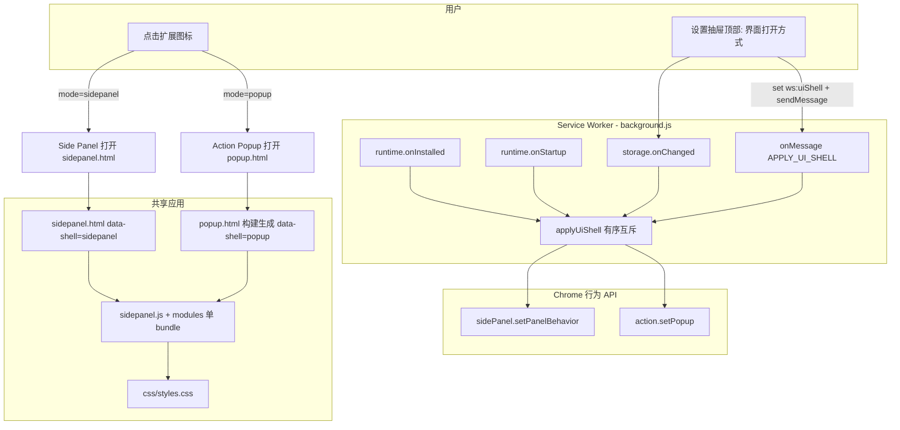
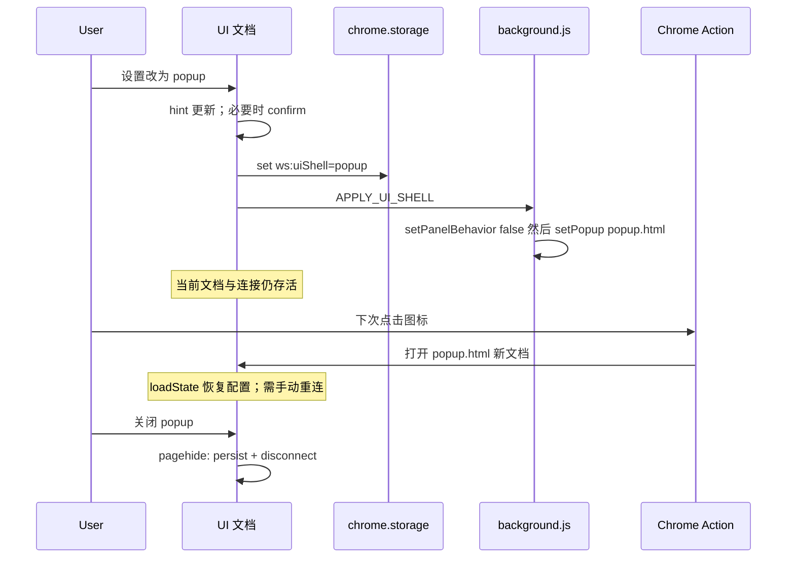

# 设计文档：用户可选 UI Shell（独立窗口 vs Side Panel）

| 字段 | 内容 |
|------|------|
| **Title** | User-selectable UI shell: Floating Window vs Side Panel |
| **Author** | TBD |
| **Date** | 2026-07-29 |
| **Status** | Implemented（修订 r3 — **产品变更：取消 action popup，改用 `chrome.windows.create` 可拖动独立窗口**） |
| **Repo** | `D:\googleExtension\websocketExtension`（及 AO worktree） |
| **Related** | `public/manifest.json`, `src/background.js`, `src/sidepanel.html`, `src/window.html`（生成）, `src/sidepanel.js`, `vite.config.js`, `src/css/styles.css` |

---

## Product revision (r3 — authoritative)

**用户明确不要** `chrome.action` 工具栏锚定 Popup。仅两种模式：

| `ws:uiShell` | 工具栏点击行为 |
|--------------|----------------|
| `sidepanel`（默认） | `setPanelBehavior({ openPanelOnActionClick: true })`；**不** `setPopup`；不依赖 `action.onClicked` |
| `window` | `openPanelOnActionClick: false` + `setPopup('')`；`action.onClicked` → `openOrFocusFloatingWindow()` |

浮动窗口规则：

- `chrome.windows.create({ url: window.html, type: 'popup', width: 420, height: 浏览器 normal 窗口高度 })`（`type: 'popup'` 仅表示 chromeless 工具窗，**仍可拖动/调整大小**，不是 action popup）。
- SW 内存跟踪 `floatingWindowId`；已存在则 `windows.update({ focused: true })`，**不**开第二窗；`windows.onRemoved` 清 id。
- 旧值 `popup` 在 `normalizeUiShell` 中迁移为 `window`。
- 权限：`storage` + `sidePanel` + **`windows`**。
- 生成孪生页：`src/window.html`（`data-shell=window`），UI 文案「独立窗口 (可拖动)」。

下文 r2 中凡写 “Action Popup / setPopup(popup.html) 作为业务 UI” 的部分 **以 r3 为准作废**；其余（单 bundle、设置顶栏、pagehide teardown、`pushLog` 反馈）仍适用，只是 shell 名改为 window。

---

## Overview

扩展通过 Chrome **Side Panel** 与可选 **独立浮动窗口** 承载调试 UI。

用户希望在两种打开方式间自由选择：

1. **Side Panel**（默认）：侧边面板，适合长时间调试、跨标签导航仍保持连接与日志。
2. **独立窗口**（可拖动）：`chrome.windows.create` 打开完整 UI 孪生页，可移到任意显示器位置；关闭后文档与连接销毁。

本设计在 **不复制** `sidepanel.js` 业务逻辑的前提下：

- 用 `chrome.storage.local` 键 `ws:uiShell` 持久化偏好（默认 `sidepanel`；合法值 `sidepanel` \| `window`）；
- 用 **MV3 service worker** 配置 `sidePanel.setPanelBehavior`，并在 window 模式用 `action.onClicked` + `chrome.windows` 打开/聚焦；
- 用 **完整 DOM 的 HTML 孪生页** `window.html`（由构建从 `sidepanel.html` 生成，`data-shell=window`）+ **同一** `sidepanel.js` bundle；
- 浮动窗视口下用 `[data-shell="window"]` CSS 保证日志区滚动与页脚可见。

---

## Background & Motivation

### 现状（代码核实 — `D:\googleExtension\websocketExtension`）

| 项 | 现状 |
|----|------|
| Manifest | MV3；权限 `storage`, `sidePanel`；无 `background`；`action` 无 `default_popup`；name/description 偏 Side Panel 文案 |
| UI 入口 | 单一：`src/sidepanel.html`（~240+ 行声明式 DOM）+ `src/sidepanel.js`（`getElementById` 绑定，不构建壳 DOM）+ `src/css/styles.css` + `src/modules/*` |
| 构建 | `vite.config.js`：`root: 'src'`，仅 `input.sidepanel`；全局 `vite-plugin-node-polyfills`；`vite-plugin-static-copy` 已 import **未使用** |
| 现网产物形态 | `mqtt_dist_extension/` 使用 **哈希** 资源名，如 `assets/sidepanel-CBKmAOxT.js`、`assets/sidepanel-Cxb8J2mQ.css` |
| 工具栏点击 | **代码未**调用 `setPanelBehavior`；不能声称“当前点击图标已稳定打开 Side Panel” |
| 状态 | 连接/日志在 **页面内存**；配置/历史/主题元数据在 `chrome.storage.local`（`ws:url`, `ws:theme`, `ws:connConfig`, `ws:topicConfigs` 等） |
| 设置 UI | `#settingsPanel` / `.settings-content`：连接向配置，末端为「应用并填充 URL」`#applyConfigBtn` |
| Toast | HTML 有 `#toastContainer`，**`sidepanel.js` 无 toast API**；用户反馈仅靠 `pushLog('sys', …)` |
| 样式 | `body { height: 100vh; overflow: hidden }`；`.app-container { height: 100%; max-width: 1200px }`；`.logs-area` 为纵向滚动区；已有 `@media (max-width: 450px)` |

### 痛点

- 长会话偏好 Side Panel；短时查看偏好 Popup。
- Chrome **同一次 action 点击不能同时**打开 Side Panel 与 Popup。
- 无 background 时无法在 install/startup/storage 变更时可靠应用行为 API。
- 点击图标打开侧栏需要 `setPanelBehavior`，今天缺失 → 体验不完整。

### 产品风险（必须先对齐）

**Popup 关闭 = 页面销毁 = 该文档内 WebSocket / MQTT 连接与内存日志全部丢失。**  
Side Panel 在用户切换标签时通常可保持打开与连接。设计必须：

- 默认 `sidepanel`；
- 选择 Popup 时明确警告（hint + 条件 confirm + banner）；
- 不承诺跨 Popup 会话的实时连接或未落盘日志；
- 已持久化数据（URL、connConfig、history chips、topic 配置）重开后可用，用户需 **重新连接**。

---

## Goals & Non-Goals

### Goals

1. 用户可在设置中选择 UI Shell：`sidepanel` | `popup`，偏好持久化。
2. 偏好在 install / browser startup / storage 变更 / UI 写后消息唤醒后应用到 **下一次** 工具栏点击。
3. **业务 JS 单份**（`sidepanel.js` + modules）；HTML 允许构建生成的 DOM 孪生页。
4. Popup 视口布局可用：header/footer 固定可见，仅日志区与打开的抽屉滚动。
5. 明确连接生命周期；文档与设置内 UX 提示到位。
6. 符合仓库约定：Vanilla JS、改 `src/` 更新相关 `AGENTS.md`、不涉及打包/分发协助。
7. 廉价自动化：normalize/映射单测 + 构建产物路径断言。

### Non-Goals

- Detach / 独立窗口（`chrome.windows`）。
- 将 WebSocket/MQTT **上移 service worker** 跨 Popup 保活。
- 日志全量持久化到 storage。
- 框架化重写、改协议栈、改 Topic 领域模型。
- 扩展打包/上架流水线。
- 新增完整 toast 系统（v1 只用 `pushLog('sys')`）。

---

## Proposed Design

### 高层架构



### 控制面：Action 点击二选一

| `ws:uiShell` | `sidePanel.setPanelBehavior` | `action.setPopup` |
|--------------|------------------------------|-------------------|
| `sidepanel`（默认） | `{ openPanelOnActionClick: true }` | `{ popup: '' }` |
| `popup` | `{ openPanelOnActionClick: false }` | `{ popup: 'popup.html' }` |

#### 应用顺序（KD-14 / Issue 15）

避免快速连点时出现“双路径竞态”：

```js
async function applyUiShell(mode) {
  const shell = mode === 'popup' ? 'popup' : 'sidepanel';
  try {
    if (shell === 'popup') {
      // 1) 先关掉 action→panel，2) 再挂 popup
      await chrome.sidePanel.setPanelBehavior({ openPanelOnActionClick: false });
      await chrome.action.setPopup({ popup: 'popup.html' });
    } else {
      // 1) 先清空 popup，2) 再打开 action→panel
      await chrome.action.setPopup({ popup: '' });
      await chrome.sidePanel.setPanelBehavior({ openPanelOnActionClick: true });
    }
  } catch (err) {
    console.error('[uiShell] applyUiShell failed', shell, err);
    // 不抛到未处理 rejection；可选：写入 storage 诊断键（非必须）
  }
}
```

- **失败模式**：`setPopup` 指向缺失文件时，工具栏点击可能无响应。PR-1/PR-3 checklist 须在 `dist/` 断言文件存在；开发时故意改错路径一次以确认 SW `console.error` 可见。
- **单一写入点**：生产路径由 SW 执行 apply。页面 **不** 常态双写 API；若 SW 未注册（极端开发失误），页面可作应急 fallback（文档注明，v1 不实现双写）。
- `side_panel.default_path` 保持 `sidepanel.html`。
- Manifest **不**静态写 `default_popup`（避免与默认 sidepanel 冲突）；运行时 `setPopup` 负责。

### Storage

| 键 | 类型 | 默认 | 说明 |
|----|------|------|------|
| `ws:uiShell` | `'sidepanel' \| 'popup'` | `'sidepanel'` | 工具栏打开方式 |
| `ws:uiShellPopupWarned` | `boolean` | 缺省/false | 是否已对 Popup 寿命做过首次 confirm |

**迁移**：缺键或非法值 → `sidepanel`；SW `onInstalled` 与 UI `loadState` 可 normalize 写回。

#### 常量与 normalize 放置（Issue 5 / KD-15）

**v1 决策：双文件内联重复**，禁止 background 从 app 图 import。

```js
// 同时出现在 src/background.js 与 src/sidepanel.js（保持字符串完全一致）
const UI_SHELL_KEY = 'ws:uiShell';
const UI_SHELL_POPUP_WARNED_KEY = 'ws:uiShellPopupWarned';
const UI_SHELL_DEFAULT = 'sidepanel';

function normalizeUiShell(value) {
  return value === 'popup' ? 'popup' : UI_SHELL_DEFAULT;
}

/** @returns {{ openPanelOnActionClick: boolean, popup: string }} */
function uiShellToActionConfig(shell) {
  const mode = normalizeUiShell(shell);
  if (mode === 'popup') {
    return { openPanelOnActionClick: false, popup: 'popup.html' };
  }
  return { openPanelOnActionClick: true, popup: '' };
}
```

- **不** 引入 `src/uiShellConstants.js`，除非后续证明共享 chunk 不会污染 SW（见 Vite 约束）。单测可复制同一纯函数到 `tests/` 或从抽离的 **零依赖测试夹具** 引用（测试文件侧），仍不强制 SW 依赖。
- 更干净的可选演进：仅当 PR 中验证 background rollup 图只含该文件时再抽共享。

### 共享 UI：完整 HTML 孪生 + 单 JS（Issue 1 / KD-5）

**事实**：`sidepanel.html` 含几乎全部 UI DOM（header、settings 抽屉、topic 面板、tab bar、session toolbar、`#logContainer.logs-area`、footer、`#toastContainer` 等）。`sidepanel.js` 启动即 `document.getElementById(...)`；**缺少任一关键 id 则功能残缺或空白**。

因此 **禁止** “10 行薄壳只引 JS” 的实现理解。

#### 强制策略（PR-3 必选）：构建时生成 `popup.html`

1. **源真相**：只手改 `src/sidepanel.html`。
2. **构建插件**（Vite `transformIndexHtml` 钩子或小 `generateBundle`/`writeBundle` 插件，或 `closeBundle` 读盘写盘）：
   - 以最终处理过的 `sidepanel.html`（或源 HTML）为输入；
   - 产出 `dist/popup.html`（开发时也可用 plugin 写到 `src/popup.html` **generated** 并 gitignore，或仅输出到 dist —— **推荐：源不手写 popup.html，仅构建产物 + 可选 dev 中间文件**）；
   - 变换：
     - `<html …>` 增加或覆盖 `data-shell="popup"`（sidepanel 源写 `data-shell="sidepanel"` 或默认无标记）；
     - `<title>` 可改为 `WebSocket Debugger (Popup)`（可选）；
     - **保留全部 body DOM 与 script/link 引用**，使 Vite 对 popup entry 与 sidepanel entry 解析到 **同一** `sidepanel.js` / CSS。
3. **Vite input**：`sidepanel` + `popup` 两个 HTML entry（popup 可为预生成模板或 plugin 在 config 阶段确保文件存在）。实用实现路径：
   - **推荐实现**：仓库内维护 `src/popup.html` 为由脚本生成的文件，`npm run build` / `prebuild` / Vite plugin `buildStart` 执行：

```js
// scripts/generate-popup-html.mjs（概念）
// read sidepanel.html → replace data-shell → write popup.html
// PR checklist: sidepanel.html 变更必须重跑生成；CI 可 diff 断言 popup.html 与生成结果一致
```

4. **禁止**长期“手工双份 HTML 无校验”。若过渡期双份手改，PR 模板 **必须** 含 checklist：「`sidepanel.html` / `popup.html` DOM id 全集一致」。**默认仍走生成**。

`sidepanel.js`：

```js
const shell =
  document.documentElement.getAttribute('data-shell') ||
  document.body?.getAttribute('data-shell') ||
  'sidepanel';
document.documentElement.setAttribute('data-shell', normalizeUiShell(
  shell === 'popup' ? 'popup' : 'sidepanel'
));
// 不要用 storage 推断 shell：用户可能侧栏仍开着但 storage 已是 popup
```

### Service Worker 职责

新文件：`src/background.js`。**硬约束：零 app 依赖** — 不得 `import` `sidepanel.js`、`mqtt`、`./modules/*`。

```js
// src/background.js — 完整职责伪代码
const UI_SHELL_KEY = 'ws:uiShell';
const UI_SHELL_DEFAULT = 'sidepanel';

function normalizeUiShell(value) {
  return value === 'popup' ? 'popup' : UI_SHELL_DEFAULT;
}

async function readShell() {
  const bag = await chrome.storage.local.get(UI_SHELL_KEY);
  return normalizeUiShell(bag[UI_SHELL_KEY]);
}

async function applyUiShell(mode) {
  const shell = normalizeUiShell(mode);
  try {
    if (shell === 'popup') {
      await chrome.sidePanel.setPanelBehavior({ openPanelOnActionClick: false });
      await chrome.action.setPopup({ popup: 'popup.html' });
    } else {
      await chrome.action.setPopup({ popup: '' });
      await chrome.sidePanel.setPanelBehavior({ openPanelOnActionClick: true });
    }
  } catch (err) {
    console.error('[uiShell] apply failed', shell, err);
  }
}

async function bootstrap() {
  const shell = await readShell();
  await chrome.storage.local.set({ [UI_SHELL_KEY]: shell });
  await applyUiShell(shell);
}

chrome.runtime.onInstalled.addListener(() => { bootstrap(); });
chrome.runtime.onStartup.addListener(() => { readShell().then(applyUiShell); });

chrome.storage.onChanged.addListener((changes, area) => {
  if (area !== 'local' || !changes[UI_SHELL_KEY]) return;
  applyUiShell(changes[UI_SHELL_KEY].newValue);
});

// 主路径之一：UI 写入后主动唤醒（与 storage.onChanged 互补，防 SW 休眠竞态）
chrome.runtime.onMessage.addListener((msg, _sender, sendResponse) => {
  if (msg?.type !== 'APPLY_UI_SHELL') return;
  readShell()
    .then(applyUiShell)
    .then(() => sendResponse({ ok: true }))
    .catch((e) => {
      console.error('[uiShell] APPLY_UI_SHELL', e);
      sendResponse({ ok: false, error: String(e) });
    });
  return true; // 异步 sendResponse
});

// 冷启动 SW 求值时也 apply 一次
bootstrap();
```

**Manifest 增量**：

```json
{
  "background": {
    "service_worker": "background.js",
    "type": "module"
  }
}
```

权限保持 `storage` + `sidePanel`。

### Vite 多入口与 SW 打包约束（Issue 2）

当前：`root: 'src'`，单 HTML entry，产物 **哈希** JS/CSS（见 `mqtt_dist_extension/assets/sidepanel-*.js`）。全局 `nodePolyfills` 对 MQTT 必要，但对 SW **有害/臃肿**。

#### 硬性约束

| # | 约束 |
|---|------|
| V1 | `rollupOptions.input`：`sidepanel`（html）、`popup`（html，生成后存在）、`background`（`src/background.js`） |
| V2 | `background.js` **禁止** import app / mqtt / modules / css |
| V3 | background **单文件输出** 到 `dist/background.js`（与 manifest `service_worker` 一致）；**不得**依赖 `chunks/*` 异步图。实现：`output.entryFileNames` 对 background 固定名；且 background 无共享模块，或使用 `manualChunks` 不把任何东西与 background 合并；必要时对 background 使用 `inlineDynamicImports` 仅当该入口单独 build |
| V4 | App 入口可继续哈希或稳定名：`entryFileNames(chunk) { if (chunk.name === 'background') return 'background.js'; return 'assets/[name]-[hash].js'; }`（app 哈希与今日一致，**仅** SW 固定） |
| V5 | CSS/asset：`assetFileNames: 'assets/[name]-[hash][extname]'`（与现网一致即可） |
| V6 | **Scope polyfills**：`vite-plugin-node-polyfills` 不得污染 SW。做法优先顺序：<br>1) 若插件支持按模块过滤则 exclude `background`；<br>2) 否则 **拆成两次 build**（app 有 polyfill，sw 无插件的轻量 config）；<br>3) 或确认 polyfill 插件只处理对 Node 内建的解析，且 background 零引用时 tree-shake 为空——**须在 PR-1 用产物体积/源映射验证**，不可假设 |
| V7 | HTML：`sidepanel.html` / `popup.html` 输出在 `dist/` 根（Vite 多页默认），供 `side_panel.default_path` 与 `setPopup` |
| V8 | 删除或真正使用 `vite-plugin-static-copy` import，避免“半残配置”误导后续改动（PR-1 顺手清理 unused import） |
| V9 | PR-1 自动化：`node` 脚本或 test：`fs.existsSync('dist/background.js')`、`dist/sidepanel.html`；PR-3 增加 `dist/popup.html`。加载 unpacked 后扩展 SW 状态无 import 错误 |

示例 `output.entryFileNames`：

```js
entryFileNames: (chunkInfo) => {
  if (chunkInfo.name === 'background') return 'background.js';
  return 'assets/[name]-[hash].js';
},
chunkFileNames: 'assets/[name]-[hash].js',
assetFileNames: 'assets/[name]-[hash][extname]',
```

**双 build 备选**（若单 config 无法隔离 polyfill）：

```text
vite.config.js          → app (sidepanel + popup HTML)
vite.sw.config.js       → only background, no polyfills, lib/iife or es single file
npm run build = vite build && vite build -c vite.sw.config.js
```

### 设置 UI 放置（Issue 6）

**精确插入点**：`#settingsPanel` → `.settings-content` 的 **最顶部**，在「模式 / 协议」grid **之前**。

```html
<div class="settings-content">
  <!-- 界面（Chrome 全局行为，非连接配置） -->
  <div class="form-section" data-section="ui-shell">
    <h4 class="section-label">界面</h4>
    <div class="form-group">
      <label>
        <span>打开方式</span>
        <select id="cfgUiShell">
          <option value="sidepanel">侧边栏 (Side Panel)</option>
          <option value="popup">工具栏弹窗 (Popup)</option>
        </select>
      </label>
      <p class="form-hint" id="uiShellHint"></p>
    </div>
  </div>
  <div class="divider"></div>
  <!-- 以下为现有连接配置：模式 / 协议 / 主机 … 应用并填充 URL -->
</div>
```

**行为（与 `#applyConfigBtn` 解耦）**：

- `#cfgUiShell` 的 `change` **立即**：`storage.set` + `sendMessage({ type: 'APPLY_UI_SHELL' })`。
- **不** 等待、**不** 依赖「应用并填充 URL」。
- 文案分区标题「界面」标明：此为浏览器打开方式，不是 MQTT/WS 连接参数。
- Out of scope：header 常驻一键切换（可未来做）；Popup banner 内 CTA 见 KD-16。

### 设置交互逻辑（Issue 7 / 10）

1. `loadState` 读 `ws:uiShell`，填充 `#cfgUiShell`，调用 `updateUiShellHint(shell)`。
2. `change` 处理：
   - `next = normalizeUiShell(select.value)`。
   - **Hint 始终更新**为与 `next` 对应的强文案（无论是否 confirm）。
   - 若 `next === 'popup'`：
     - 若 `status === Connected` **或** `ws:uiShellPopupWarned !== true` → `window.confirm(…寿命说明…)`；取消则 select 回滚并 return。
     - 确认后若首次：`storage.set({ ws:uiShellPopupWarned: true })`。
   - `await chrome.storage.local.set({ ws:uiShell: next })`。
   - `await chrome.runtime.sendMessage({ type: 'APPLY_UI_SHELL' })`（忽略 SW 短暂未就绪时的 catch，storage 监听仍会 apply）。
   - **`pushLog('sys', '界面打开方式已设为…，将在下次点击扩展图标时生效。')`** — **v1 不使用 toast**（`#toastContainer` 无实现；不新增 toast 基建）。
3. 从 popup → sidepanel：无 confirm（不杀连接）；仍 `pushLog` + hint 更新。

Hint 文案示例（popup）：

> 弹窗关闭后，当前页面内的连接与实时日志会丢失。长时间调试请使用侧边栏。此项立即保存，**不**需要点「应用并填充 URL」。

### 模式切换与连接生命周期



| 场景 | 行为 |
|------|------|
| 偏好改为 popup，当前 panel 仍开 | SW 立即切换 API；**不**自动关 panel；连接仍在 |
| 关闭 Popup / Side Panel | 文档卸载 → 连接死、内存日志丢；storage 配置保留 |
| 仅改偏好不关页 | **不**自动 disconnect |
| 重开任意 shell | 恢复可持久数据；**不**自动 `connect()`（与现 `init()` 一致） |
| PR-2 过渡、尚无 `popup.html` | 允许临时 `setPopup({ popup: 'sidepanel.html' })`，**降级**：无 `data-shell=popup` banner/紧凑样式；PR-3 切到 `popup.html` |

### 文档卸载清理（Issue 9）

**强制**（PR-3，**两个 shell 共用**，非 popup-only）：

```js
function onDocumentTeardown() {
  try { persistState(); } catch (_) {}
  try { persistConfig(); } catch (_) {} // 若有未刷新的 cfg DOM
  try { stopIdleWatcher(); } catch (_) {}
  try { disconnect(); } catch (_) {} // 内部 stopMqttClient + ws.close；幂等
}

window.addEventListener('pagehide', onDocumentTeardown);
// beforeunload 可选双挂；须保证 disconnect/stopMqttClient 可重复调用无抛错
```

- `disconnect()` 今日不 persist → teardown 中 **显式** `persistState`。
- 与 socket `onclose` 双触发：`disconnect` / `stopMqttClient` 已有空引用防护；`setStatus` 重复为 disconnected 可接受。
- 目的：MQTT 内部 timer 卫生（Side Panel 关闭同样受益）。

### Popup 布局适配（Issue 8）

**原则**：Chrome popup 按内容/平台限制尺寸（约 ≤800×600）；`100vh` 在 popup 内不可靠。现有 `body { overflow: hidden }` + flex 列 + `.logs-area { overflow-y: auto }` 应保留 **日志区为唯一主滚动**。

```css
/* src/css/styles.css — popup shell */
html[data-shell="popup"],
html[data-shell="popup"] body {
  width: 100%;
  height: 100%;
  min-width: 360px;
  min-height: 480px; /* KD-16：与 Open Questions 决议一致，不用 420 */
  overflow: hidden;
}

html[data-shell="popup"] .app-container {
  max-width: none;
  height: 100%;
  min-height: 480px;
  /* 不设 max-height: 600px 硬裁切，避免与 body overflow:hidden 夹死 footer */
}

html[data-shell="popup"] .logs-area {
  flex: 1 1 auto;
  min-height: 0; /* flex 子项可收缩，保证内部滚动 */
  overflow-y: auto;
}

html[data-shell="popup"] .settings-panel,
html[data-shell="popup"] .topic-manage-panel {
  max-height: 100%;
  overflow-y: auto;
}
```

**滚动所有权**：

| 区域 | 滚动 |
|------|------|
| 主列 header / topic tabs / session toolbar / footer | 固定（不随主列表滚动） |
| `.logs-area` | 主消息滚动 |
| 打开的 settings / topic 抽屉 | 抽屉内部滚动 |

**手工测试**：短视口下发送框可见；打开设置抽屉可滚到 hint 与按钮。

### Popup 专属 UX

- Banner（仅 `data-shell="popup"`）：寿命警告 + **按钮「改用侧边栏」**（写入 `ws:uiShell=sidepanel` + `APPLY_UI_SHELL` + `pushLog`）（KD-16）。
- 不在 banner 上实现 toast。

### 与现有模块的边界

| 区域 | 改动 |
|------|------|
| `src/modules/*` | 原则上不改 |
| `src/sidepanel.js` | keys、设置、hint/banner、shell 标记、teardown、message |
| `src/sidepanel.html` | 顶部「界面」块、`data-shell`、banner 节点 |
| `src/popup.html` | **生成物**（非手维业务 DOM） |
| `src/background.js` | 新建 apply / 监听 |
| `scripts/generate-popup-html.mjs` 或 Vite plugin | 新建 |
| `src/css/styles.css` | popup 布局 + banner + section-label |
| `public/manifest.json` | `background` |
| `vite.config.js` | 多入口、entryFileNames、polyfill 隔离、清理 unused import |
| `tests/*` | normalize + action config 映射 |
| `AGENTS.md` / `src/css/AGENTS.md` | 职责更新 |

### AGENTS.md 更新规则

1. 根 `AGENTS.md`：说明双 HTML 入口、SW、`ws:uiShell`；popup.html 为生成物。
2. `src/css/AGENTS.md`：`[data-shell="popup"]` 滚动约定。
3. modules AGENTS：无改可不更。
4. 禁止打包/分发协助（`.agents/rules/no-packaging.md`）。

---

## API / Interface Changes

### Chrome Extension API

| API | 用途 |
|-----|------|
| `chrome.sidePanel.setPanelBehavior` | action 是否打开侧栏 |
| `chrome.action.setPopup` | 设置/清空 popup 页 |
| `chrome.storage.local` | `ws:uiShell`, `ws:uiShellPopupWarned` |
| `chrome.runtime.onInstalled` / `onStartup` | 应用偏好 |
| `chrome.storage.onChanged` | 偏好热更新 |
| `chrome.runtime.onMessage` `APPLY_UI_SHELL` | **v1 必选** UI 唤醒 apply |

### 消息协议（v1 全集）

```js
// 请求
{ type: 'APPLY_UI_SHELL' }
// 响应
{ ok: true } | { ok: false, error: string }
```

无其它 message 类型。状态源仍是 storage；消息只触发 re-read + apply。

### 应用内

见上文 `normalizeUiShell` / `uiShellToActionConfig`（双文件重复定义）。

---

## Data Model Changes

```text
chrome.storage.local["ws:uiShell"] = "sidepanel" | "popup"   // default sidepanel
chrome.storage.local["ws:uiShellPopupWarned"] = true | false  // optional flag
```

其它 `ws:*` 键不变。迁移：缺失 → sidepanel。

### 日志/连接预期

| 数据 | 文档关闭后 | 换 shell 重开 |
|------|------------|----------------|
| 连接 | 断开 | 手动重连 |
| 内存日志 | 丢失 | 空 |
| history / URL / topic 配置 / theme | 保留 | 恢复 |

---

## Alternatives Considered

### 方案 A：Side Panel + `windows.create` 小窗 — Rejected v1

独立窗寿命更好，但非“工具栏 popup”心智，权限与窗口管理更重。

### 方案 B：连接放在 SW，UI 纯视图 — Rejected v1

跨 popup 保活，但 MQTT/polyfill/消息总线/日志缓冲工程量过大。

### 方案 C：两套完整手维 HTML+JS — Rejected

双倍业务逻辑；JS 必须单份。HTML 允许 **生成孪生**，不等于复制 JS。

### 方案 D：无 SW，仅在 sidepanel 打开时 setPopup — Rejected

装后从未打开 panel 则偏好不生效。

### 方案 E（Accepted）：Storage + SW 有序互斥 API + 生成 HTML 孪生 + 单 bundle + 设置抽屉 + 诚实寿命 UX

### 方案 F：单 HTML + `setPopup('sidepanel.html?shell=popup')` — Deferred / Rejected for v1（Issue 14）

- **优点**：无第二 HTML 文件。
- **缺点**：`action.setPopup` / 扩展 URL 对 query 的校验与缓存行为不统一；运行时用 storage 推断 shell 会在“侧栏仍开 + 偏好已改”时误标。
- **结论**：v1 **不用** query 区分 shell；采用静态 `data-shell` 的孪生 HTML。若未来 Chromium 明确保证 query 路径，可再评估并删生成步骤。

---

## Security & Privacy Considerations

| 风险 | 严重度 | 缓解 |
|------|--------|------|
| 无新增权限 | 低 | 仍 `storage` + `sidePanel` |
| 密码在 `ws:connConfig` | 中（已有） | SW 不打印 password |
| setPopup 错误路径 | 中 | 构建断言 + SW console.error |
| SW 挂起 | 低 | 行为 API 副作用已持久；startup/message 再 apply |

---

## Observability

1. UI：`pushLog('sys', …)` 切换反馈（无 toast）。
2. SW：`console.error` 失败路径；开发期可 `console.debug('[uiShell]', mode)`。
3. **自动化（Issue 12）**：
   - `tests/ui-shell.node.test.js`（或并入现有 node 测试风格）：`normalizeUiShell`、`uiShellToActionConfig` 真值表。
   - `tests/check-dist-ui-shell.mjs`（或 npm script）：build 后断言 `dist/background.js`、`dist/sidepanel.html`、（PR-3+）`dist/popup.html` 存在。
4. **手工**：安装默认点击 → Side Panel；改 popup → 关闭 panel → 点击为 Popup；关 popup 连接断；重启浏览器偏好保留；短视口 footer 可见。

---

## Rollout Plan

1. 默认 storage `sidepanel`；PR-1 **有意**启用 action→Side Panel（见下，非零可感知差异）。
2. 分 PR 合并（PR Plan）；PR-2 与 PR-3 保持拆分以便回滚。
3. 回滚：代码回滚；或用户改回侧边栏；或 SW hotfix 强制 sidepanel。
4. **Manifest 文案**（Issue 13）：v1 可暂留；PR-4 或 PR-2 可选将 `description` 改为同时提及 Side Panel / 工具栏弹窗，`default_title` → `Open WebSocket Debugger`。

---

## Open Questions

| ID | 问题 | 状态 |
|----|------|------|
| OQ-1 | Popup min 尺寸 | **已决议 KD-16：360×480** |
| OQ-2 | Banner 一键改回侧边栏 | **已决议 KD-16：v1 要做** |
| OQ-3 | `action.default_title` 随模式变 | 仍开放（nice-to-have） |
| OQ-4 | 日志会话持久化补齐 Popup 短命 | 仍开放（独立特性） |
| OQ-5 | 文案「侧边栏」vs「侧边面板」 | **已决议：设置内用「侧边栏 (Side Panel)」** |
| OQ-6 | 是否双 build 隔离 polyfill | 实现期验证后定；优先单 config + 证明 SW 无 polyfill 污染 |

---

## Key Decisions

| # | 决策 | 选择 | 理由 |
|---|------|------|------|
| KD-1 | 默认打开方式 | `sidepanel` | 连接寿命更安全；匹配迁移默认 |
| KD-2 | 偏好键 | `ws:uiShell` | 与 `ws:*` 一致 |
| KD-3 | 行为应用位置 | Service Worker | install/startup 必需 |
| KD-4 | Action 互斥 | 成对 setPanelBehavior + setPopup | Chrome 约束 |
| KD-5 | UI 复用 | **完整 HTML 孪生（构建生成 popup.html）+ 单 sidepanel.js**；禁止 10 行空壳 | DOM 全在 HTML；JS 不建壳 |
| KD-6 | 页面↔SW 状态与唤醒 | **状态源 = storage**；**必选** `storage.onChanged` **与** `onMessage(APPLY_UI_SHELL)` | 消除 SW 休眠竞态；仅此一种消息 |
| KD-7 | 切换偏好时连接 | 不自动 disconnect；关文档才死 | 可预期 |
| KD-8 | Popup 丢连接 | 警告 + banner + 默认 sidepanel；不做 SW 持连 | 范围控制 |
| KD-9 | 设置入口 | 抽屉 **顶部**「界面」分区；立即生效，不经 applyConfigBtn | 全局 Chrome 行为 vs 连接配置分离 |
| KD-10 | 样式 | `src/css` + `[data-shell="popup"]`；日志区主滚动 | 遵守 css AGENTS |
| KD-11 | 构建产物名 | **仅** `background.js` 固定；app JS/CSS 可继续 content hash | manifest 稳引用 SW；app 与现网一致 |
| KD-12 | Agent 文档 | 更新根与 css AGENTS | 仓库约定 |
| KD-13 | 非目标 | detach、SW 持连、打包、v1 toast 系统 | 范围 |
| KD-14 | apply 顺序 | 先 disable 旧路径，再 enable 新路径；try/catch + console.error | 降竞态/可观测失败 |
| KD-15 | 共享常量 | v1 **双文件重复**字符串与 normalize；SW 零 app import | 防 chunk 耦合 |
| KD-16 | Popup UX 尺寸与 CTA | min **360×480**；banner **含**「改用侧边栏」 | 收束 OQ-1/2 |
| KD-17 | 用户反馈通道 | v1 **仅** `pushLog('sys')` | 无 toast 实现 |
| KD-18 | PR-1 产品语义 | **钉死** action 点击打开 Side Panel（有意 UX 强化，非“与现网零差异”） | 代码从未 setPanelBehavior |
| KD-19 | 卸载钩子 | 两 shell 均 `pagehide` → persist + stopIdle + disconnect | MQTT 卫生 |
| KD-20 | 首次 popup 教育 | confirm if connected **或** 未 `ws:uiShellPopupWarned`；hint 始终更新 | 补齐未连接用户教育 |

---

## Risks

| ID | 风险 | 严重度 | 缓解 |
|----|------|--------|------|
| R1 | Popup 关丢失连接被当成 bug | **高** | 默认 sidepanel；confirm；hint；banner；文档 |
| R2 | dist 路径/SW import 错误导致点击无响应 | **高** | 固定 background.js；产物断言；加载 SW 检查 |
| R3 | SW 休眠导致仅写 storage 未 apply | **中** | **必选** APPLY_UI_SHELL + onChanged（KD-6） |
| R4 | panel 与 popup 同时存在、内存不共享 | **低** | 文档说明可接受 |
| R5 | MQTT 销毁泄漏 timer | **中** | teardown disconnect；幂等 stopMqttClient |
| R6 | HTML 孪生漂移 | **中** | 生成 popup.html + CI/PR checklist |
| R7 | polyfill 打进 SW | **中** | V6 约束 + 产物审查 |
| R8 | PR-1 改变“点击图标”行为引发惊讶 | **中** | 发布说明：此前未绑定 action→panel，现默认绑定侧栏 |

---

## References

- `D:\googleExtension\websocketExtension\public\manifest.json`
- `src/sidepanel.html`（声明式 DOM + `#toastContainer` 无 JS API）
- `src/sidepanel.js`（`storageKeys`, `disconnect`, `stopMqttClient`, `init` 无 auto-connect）
- `src/modules/TopicStorage.js`
- `vite.config.js`；产物参考 `mqtt_dist_extension/assets/sidepanel-*.js`
- `src/css/styles.css`（`.logs-area`, body overflow）
- `AGENTS.md`, `src/css/AGENTS.md`, `src/modules/AGENTS.md`, `.agents/rules/no-packaging.md`
- `docs/02-architecture.md`
- Chrome Side Panel / Action / MV3 SW 文档

---

## PR Plan

增量可合并；PR-2 与 PR-3 **保持拆分**（不建议挤成一个大 PR）。

### PR-1：Service Worker + 钉死默认 action → Side Panel + Vite SW 输出

| 项 | 内容 |
|----|------|
| **Title** | feat: MV3 service worker pins action-click to Side Panel |
| **Deps** | 无 |
| **Files** | `src/background.js`, `public/manifest.json`, `vite.config.js`（entryFileNames、background input、polyfill 隔离/验证、移除 unused `viteStaticCopy` import）, `tests/ui-shell.node.test.js`（normalize + mapping 可先测纯函数拷贝）, `tests/check-dist-ui-shell.mjs` 或 npm script, 根 `AGENTS.md` |
| **Description** | 引入 SW；`applyUiShell('sidepanel')` 有序执行（先 clear popup，再 `openPanelOnActionClick: true`）。**明确产品语义：此前代码未绑定工具栏点击打开侧栏；本 PR 有意启用。** 不暴露 UI 设置。`dist/background.js` 单文件、无 app/mqtt 依赖。 |
| **Test** | `npm run build` 后存在 `dist/background.js`、`dist/sidepanel.html`；单元测试 mapping；加载 unpacked，SW 无错；**点击工具栏图标打开 Side Panel**；故意错误 popup 路径一次看 console.error（开发备忘） |

### PR-2：`ws:uiShell` + 设置顶栏「界面」+ 必选 message 唤醒

| 项 | 内容 |
|----|------|
| **Title** | feat: ws:uiShell preference in settings (immediate apply) |
| **Deps** | PR-1 |
| **Files** | `src/background.js`（onChanged + APPLY_UI_SHELL）, `src/sidepanel.html`（顶部界面分区）, `src/sidepanel.js`, `tests/ui-shell.node.test.js` 扩展, 根 `AGENTS.md`；可选 manifest description/title 软化 |
| **Description** | 读写 `ws:uiShell`；设置 **顶部** 控件立即 storage + message；hint 始终更新；popup confirm（已连接或未 warned）；**仅** `pushLog('sys')`。若尚无 popup.html：临时 `setPopup('sidepanel.html')`，文档注明 **降级 Popup UX**（无 banner/data-shell）。不把 PR-3 挤入。 |
| **Test** | 切换后下次点击路径变化；重启保偏好；不点「应用并填充 URL」也能切换；单测 normalize |

### PR-3：生成 `popup.html` + popup CSS + banner CTA + pagehide 清理

| 项 | 内容 |
|----|------|
| **Title** | feat: generated popup.html shell, compact CSS, teardown hooks |
| **Deps** | PR-2 |
| **Files** | 生成脚本或 Vite plugin、`src/popup.html`（生成）、`vite.config.js`、`src/background.js`（popup.html 路径）、`src/css/styles.css`、`src/css/AGENTS.md`、`src/sidepanel.html`/`sidepanel.js`（banner + pagehide）、dist check 含 popup.html |
| **Description** | 完整 DOM 孪生 + `data-shell=popup`；CSS 滚动所有权；banner+改回侧边栏；`pagehide` persist+disconnect+stopIdle（双 shell）；setPopup 指向 popup.html。 |
| **Test** | 关 popup 连接断；短视口发送框可见；抽屉可滚；sidepanel 无 banner；生成脚本在改 sidepanel.html 后 diff 清洁；DOM id 与 sidepanel 一致 |

### PR-4（可选）：文档与文案

| 项 | 内容 |
|----|------|
| **Title** | docs: UI shell modes, action-click behavior, connection lifetime |
| **Deps** | PR-3 |
| **Files** | `docs/01-overview.md`, `docs/02-architecture.md`（更新架构图，勿再只画 sidepanel）, `docs/04-development-guide.md`；可选 manifest name/description/default_title |
| **Description** | 产品行为、双入口、生成 popup 流程、验证清单；**无打包步骤**。 |
| **Test** | 文档审阅 |

---

*End of design document (r2).*
